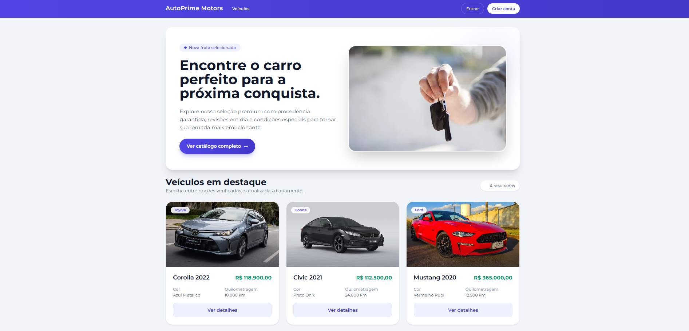
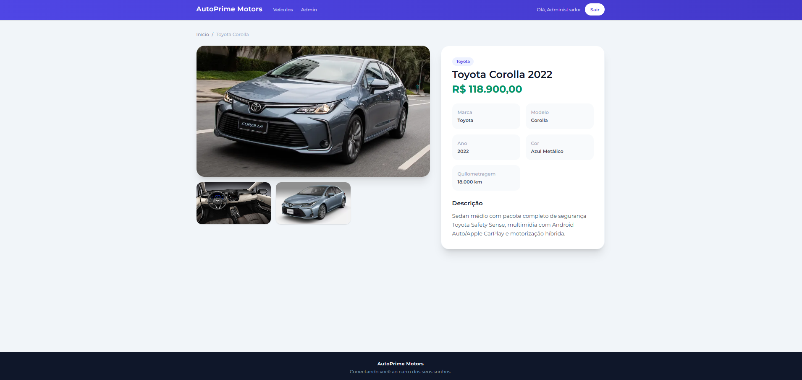
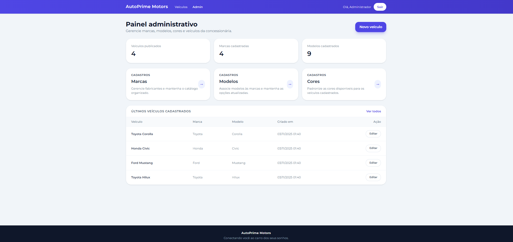

# AutoPrime Motors — Catálogo e Gestão de Veículos

Aplicação completa desenvolvida em Laravel para exibição e gerenciamento de veículos de uma concessionária. O projeto disponibiliza uma vitrine pública responsiva para visitantes e um painel administrativo protegido por autenticação para cadastro de marcas, modelos, cores e veículos com múltiplas fotos.

## Funcionalidades

### Área pública
- Listagem paginada de veículos com foto principal, marca, modelo, ano, quilometragem e preço.
- Página de detalhes com descrição completa e galeria (mínimo de três fotos por veículo).
- Layout responsivo com Tailwind CSS e tipografia moderna.

### Área administrativa (restrita a administradores)
- Dashboard com indicadores rápidos e últimos veículos cadastrados.
- CRUD completo para marcas, modelos, cores e veículos.
- Validações para garantir relacionamento correto entre marca e modelo e mínimo de três fotos por veículo (foto principal + pelo menos duas adicionais).
- Controle de acesso via middleware específico para administradores.

## Tecnologias utilizadas

- Laravel 12 (PHP 8.2)
- Blade Templates + Tailwind CSS (via CDN configurado)
- Autenticação nativa com controllers personalizados (login, registro e logout)
- MySQL (migrations, seeders e relacionamentos via Eloquent)

## Modelagem do banco

- `brands` → marcas de veículos (relacionamento 1:N com modelos).
- `vehicle_models` → modelos pertencentes a uma marca.
- `colors` → catálogo de cores disponíveis.
- `vehicles` → veículos disponibilizados na vitrine, relacionando marca, modelo, cor e usuário criador.
- `vehicle_photos` → URLs de fotos adicionais, garantindo galeria com mínimo de três imagens.

## Como rodar o projeto

```bash
composer install
cp .env.example .env
php artisan key:generate
# ajuste as credenciais de conexão ao MySQL no arquivo .env
php artisan migrate --seed
php artisan serve
npm install
```

> As seeds criam os dados iniciais de catálogo e o usuário administrador padrão.

## Credenciais padrão

- E-mail: `admin@concessionaria.com`
- Senha: `password`

## Estrutura de diretórios

- `app/Models` — Modelos Eloquent (Brand, VehicleModel, Color, Vehicle, VehiclePhoto, User).
- `app/Http/Controllers` — Controllers públicos, administrativos e de autenticação.
- `database/migrations` — Estrutura das tabelas e chaves estrangeiras.
- `database/seeders` — População inicial de marcas, modelos, cores e veículos.
- `resources/views` — Layout base, páginas públicas, formulários administrativos e telas de login/registro.
- `public/assets` — CSS customizado e ilustrações (prints) utilizadas no README.

## Prints das telas principais

| Página inicial | Detalhes do veículo | Painel administrativo |
| --- | --- | --- |
|  |  |  |
